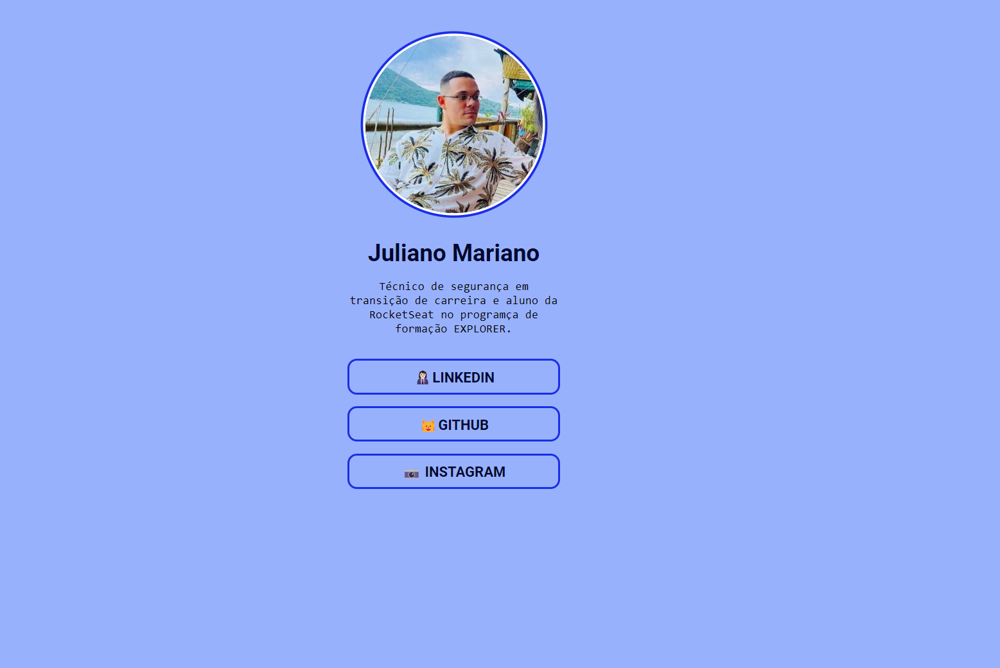

<h1 align="center"> Meu Perfil de Links </h1>

Meu perfil de links foi uma aplicação proposta pela RocketSeat no evento Maratona explorer dentro do programa de formação Full-Stack e desenvolvida por mim, Juliano Mariano.  

  <a href="#-tecnologias">Tecnologias</a>&nbsp;&nbsp;&nbsp;|&nbsp;&nbsp;&nbsp;
  <a href="#-projeto">Projeto</a>&nbsp;&nbsp;&nbsp;|&nbsp;&nbsp;&nbsp;
  <a href="#-Contato">Contato</a>

 

  

## 🚀 Tecnologias

Esse projeto foi desenvolvido com as seguintes tecnologias:

- HTML e CSS;
- Git e Github;
- Figma.

## 💻 Projeto

Meu perfil de links é uma aplicação indispensável para facilitar a interação e comunicação de futuros recrutadores com futuros talentos. 
Sabemos que as redes socais são ferramentas extraordinarias de comunicação e interação humana, mas nem todas permitem colocarmos nossas redes socais a aplicação tem esse fundamento, organizar todos os meios de comunicação em um único local. 

- [Visite o projeto online](https://julianomariano.github.io/bruxinha-do-destino/)

<!-- ## 🔖 Layout

Você pode visualizar o layout do projeto através [DESSE LINK](https://www.figma.com/community/file/1182751789348533739). É necessário ter conta no [Figma](https://figma.com) para acessá-lo. -->

## 🌐 Contato

LinkedIn: Juliano Mariano
 -  https://www.linkedin.com/in/juliano-marianodev/